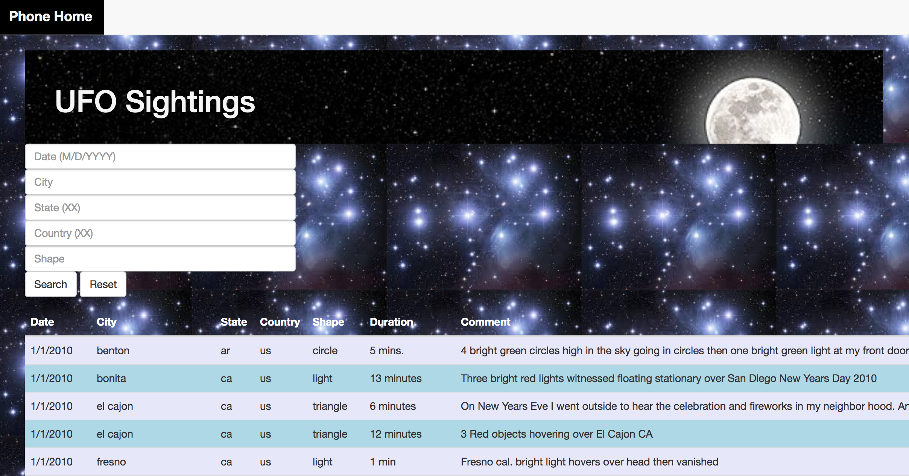

# UFO Eyewitness Sightings | JavaScript and DOM Manipulation

## Purpose

I set out to solve the everyman's problem: it's simply too difficult to stay on top of UFO sightings these days. Moreover, I wanted to create a dead-simple, user-centric interface that would empower users to research and discover historical trends in UFO sightings over the years.

With the vast number of sightings now on record, traditional means of cataloging (stone tablets, ledgers, Excel) are starting to bend under the pressure of serious volume. This has made search and storage cumbersome. It's clearly past time to make these data more widely available over the web.

To guard against extraterrestrial interference, the product leverages only pure JavaScript, HTML, and CSS; nothing else can be trusted. With any luck, this project helps Earthlings everywhere -- and doesn't end up in the wrong hands.

## Features
### Automatic Table

This project uses the UFO dataset in the form of a JavaScript object. I appended the sightings table to an HTML web page and added new rows of data for each UFO sighting. Table columns include:
* `date/time`
* `city`
* `state`
* `country`
* `shape`
* `comment`

### Multiple Search Categories

The user can set multiple column filters and search for UFO sightings based on table column criteria. Using multiple `input` tags, columns are searched and user input is matched.

write JavaScript code so the user can to set multiple filters and search for UFO sightings using the following criteria based on the table columns: 

### Dataset

* [UFO Sightings Data](Data/data.js)

## Preview

